# TODO - Task & Tick

A modern, feature-rich Todo application for Android with task management, categories, priorities, and more.

<div align="center">
    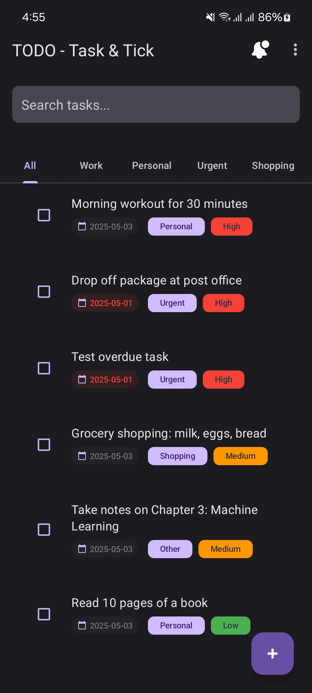
    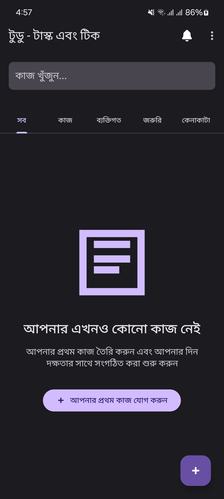
    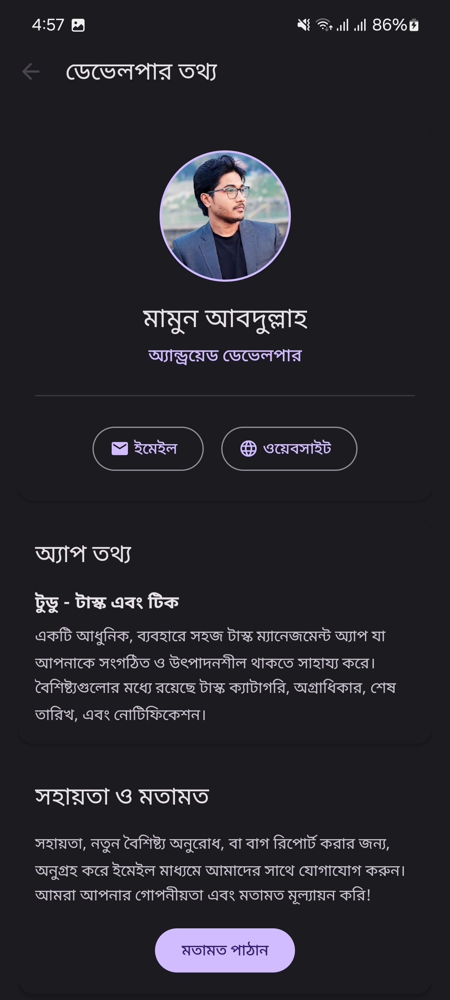
</div>

## Features

- **Task Management**: Create, edit, and delete tasks with ease
- **Categories**: Organize tasks by categories (Work, Personal, Urgent, Shopping, Other)
- **Priority Levels**: Assign High, Medium, or Low priority to tasks
- **Due Dates**: Set and track task deadlines
- **Filtering**: Filter tasks by category, priority, or completion status
- **Search**: Search through tasks instantly
- **Multi-Select**: Select multiple tasks for bulk operations
- **Dark Mode**: Full support for light and dark themes
- **Multi-Language Support**: Available in English and Bengali
- **Notifications**: Get reminders for overdue tasks
- **Data Import/Export**: Back up and restore your tasks

## Screenshots

<div align="center">
    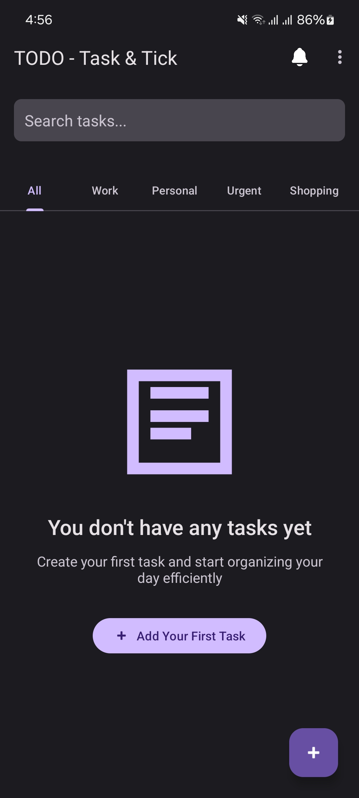
    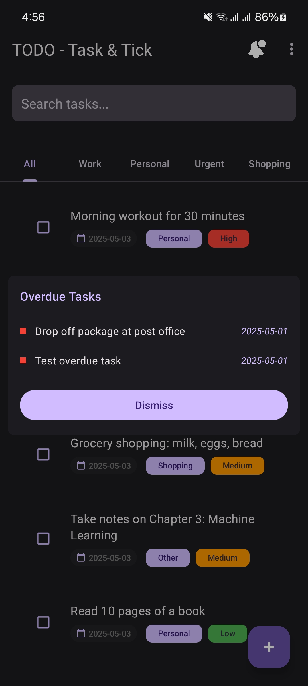
    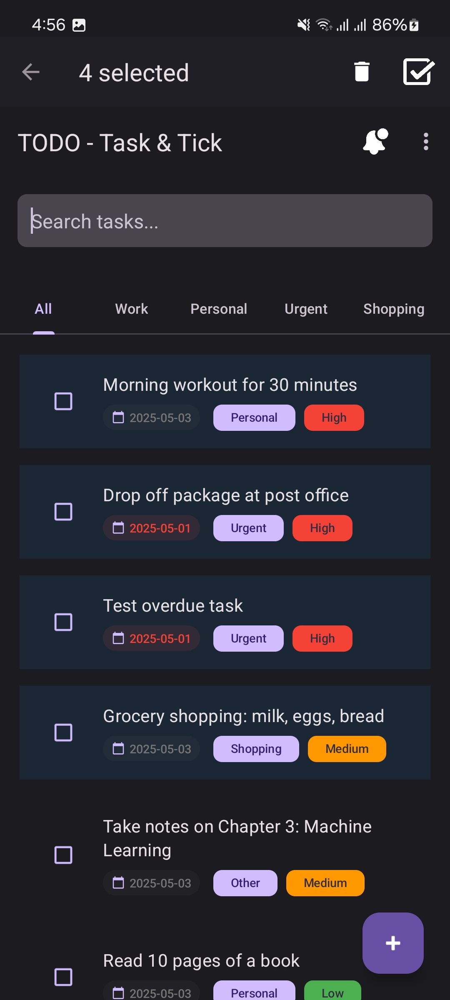
    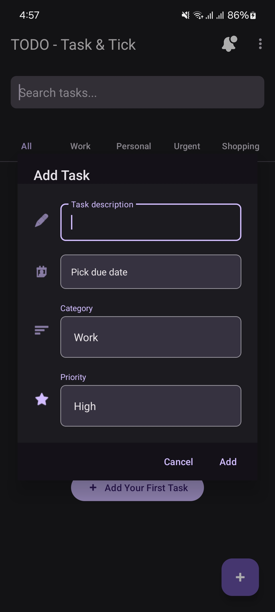
</div>

<div align="center">
    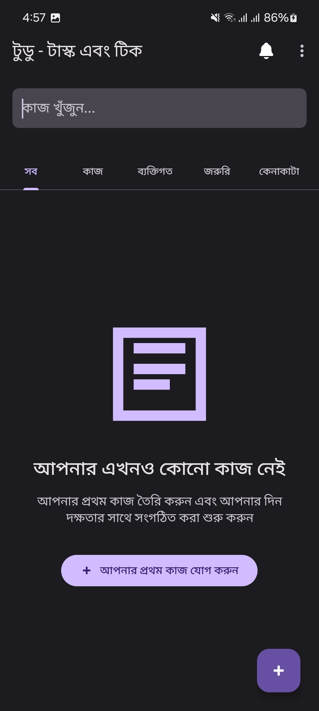
    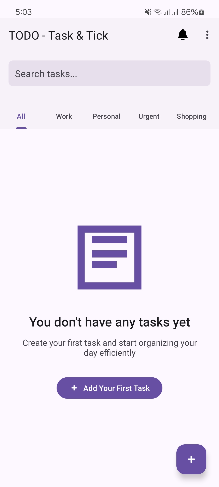
    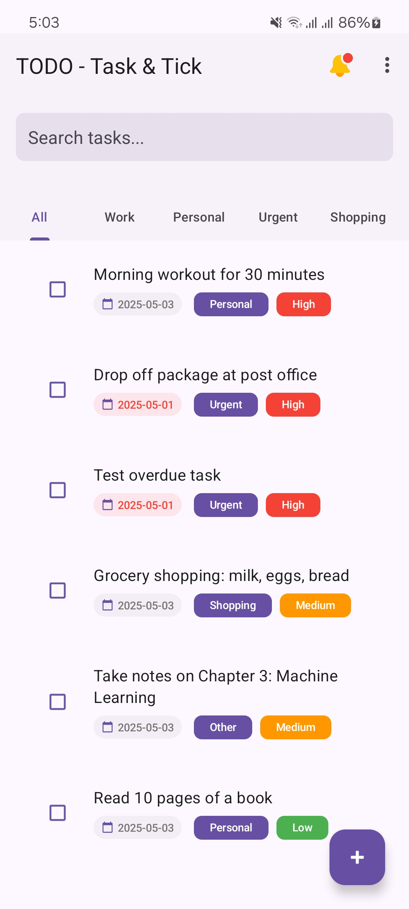
    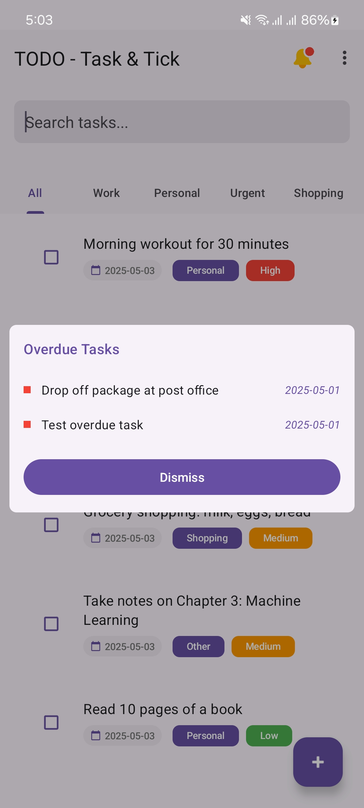
</div>

## Installation

### Download APK
Download the latest release APK from the [Releases](../../releases) section.

### Build from Source
- Clone this repository
- Open in Android Studio
- Build and run

## Building the App

### Prerequisites
- Android Studio Chipmunk or newer
- JDK 11 or newer
- Gradle 7.4 or newer

### Debug Build
To build a debug version of the app, run:
```
./gradlew assembleDebug
```

The debug APK will be generated at `app/build/outputs/apk/debug/app-debug.apk`

### Release Build
To build a signed release version of the app, run:
```
./gradlew assembleRelease
```

The signed release APK will be generated at `app/build/outputs/apk/release/app-release.apk`

## App Bundle (Alternative to APK)
Google Play prefers Android App Bundles over APKs. To generate an AAB file:
```
./gradlew bundleRelease
```

The AAB file will be located at `app/build/outputs/bundle/release/app-release.aab`

## Keystore Information

The app is signed with the following keystore:
- Keystore file: `keystore/todo_app_keystore.jks`
- Keystore password: `todoapp123`
- Key alias: `todo_app_key`
- Key password: `todoapp123`

**Important**: Keep this keystore file secure. If you lose it, you won't be able to update your app on the Play Store.

## Publishing to Google Play Store

For detailed instructions on publishing to the Google Play Store, see the [PUBLISHING.md](PUBLISHING.md) guide.

## Alternative App Stores

For instructions on publishing to alternative app stores, see the [ALTERNATIVE_STORES.md](ALTERNATIVE_STORES.md) guide.

## License

This project is licensed under the MIT License - see the [LICENSE](LICENSE) file for details.

## Contributing

Contributions are welcome! Please feel free to submit a Pull Request.

## Contact

If you have any questions or suggestions, please reach out:
- Email: support@mamunwrites.com 